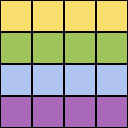
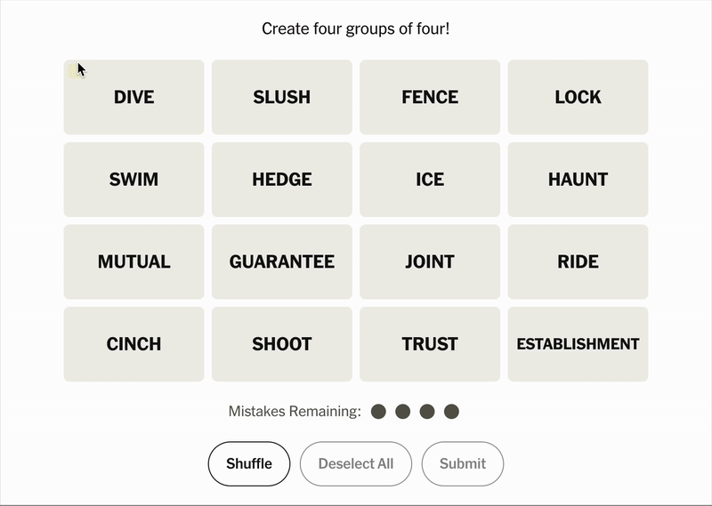

# Connections Helper
<p align="center">
  
</p>

An extension to help you keep track of the color categories in [Connections](https://www.nytimes.com/games/connections). Download the **[Chrome extension here]()** or the **[Firefox add-on here]()**.

## Demo
<p align="center">
    
</p>


## Setup
You can download the **[Chrome extension here](https://chromewebstore.google.com/detail/wordle-helper/bpfjeiapklolnoijiopkeemgjckpfipj)** or the **[Firefox add-on here](https://addons.mozilla.org/en-US/firefox/addon/connections-helper)**.

You can also clone the repo and load it as an **[unpacked extension](https://developer.chrome.com/docs/extensions/get-started/tutorial/hello-world#load-unpacked)** in Chrome or as a **[temporary add-on](https://extensionworkshop.com/documentation/develop/temporary-installation-in-firefox/)** in Firefox. Please leave a review ([Chrome](https://chromewebstore.google.com/detail/wordle-helper/bpfjeiapklolnoijiopkeemgjckpfipj/reviews), [Firefox](https://addons.mozilla.org/en-US/firefox/addon/connections-helper/reviews)) if you enjoy the extension!

## Updating and publishing
### Chrome Web Store
Once the extension is ready for publishing, you need to `zip` the file up for upload to the [Chrome Web Store](https://chromewebstore.google.com/) via the [Developer Console](https://chrome.google.com/webstore/devconsole/), which can be done via the following command from the project root:

```bash
npm install && npm run build:chrome
```

The resulting `connections-helper-chrome.zip` file will be in the `dist` folder, as well as the project root so that it can be committed to source. From there, upload the zip file to the developer console and begin the review process. Don't forget to bump the version number in [manifest.chrome.json](manifests/manifest.chrome.json) before bundling!

### Firefox Add-Ons
Once the add-on is ready to be published, you need to `zip` the file up for upload to [AMO](https://addons.mozilla.org) via the [Developer Hub](), which can be done via the following command from the project root:

```bash
npm install && npm run build:firefox
```

The resulting `connections-helper-firefox.zip` file will be in the `dist` folder, as well as the project root so that it can be committed to source. From there, upload the zip file to the developer hub to begin the review process. Don't forget to bump the version number in [manifest.firefox.json](manifests/manifest.firefox.json) before bundling!

